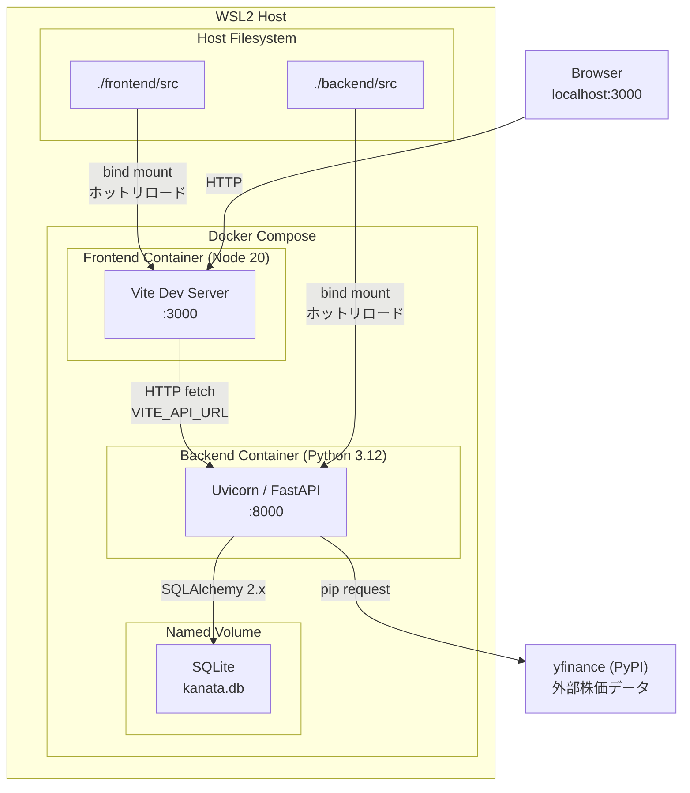
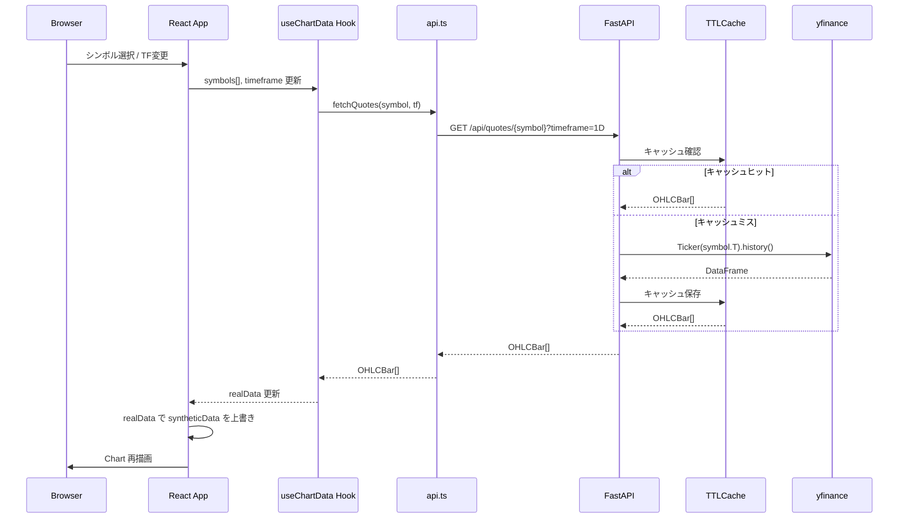
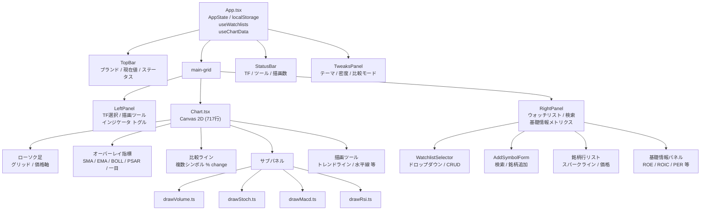
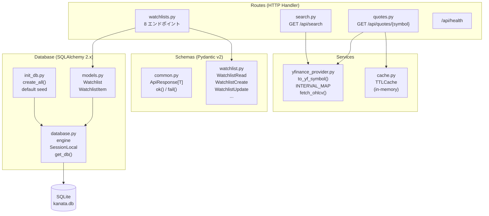
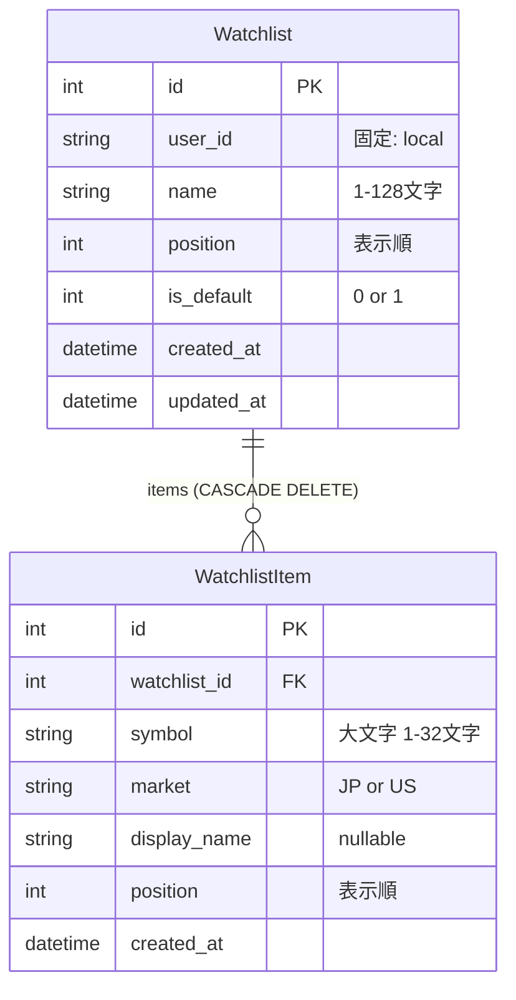
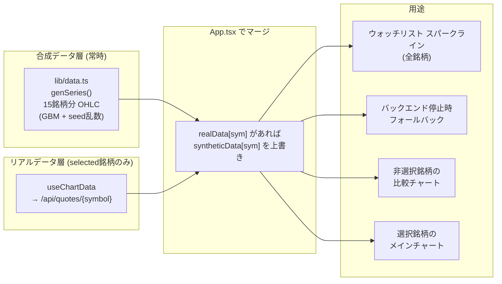
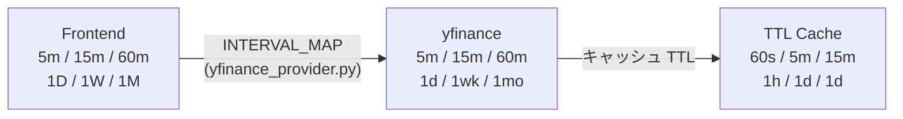

# KANATA Architecture

## 1. システム全体図



---

## 2. データフロー



---

## 3. フロントエンド コンポーネントツリー



---

## 4. 状態管理

```mermaid
graph LR
    subgraph APP["App.tsx (単一ソース)"]
        STATE["AppState\nselected[]\ntimeframe\nactiveTool\ndrawings[]\nindicators{}\nindicatorParams{}"]
        AES["Aesthetic\ndark-blue / neutral\namber-crt / midnight"]
        DEN["Density\ncompact / comfortable"]
        AWL["activeWatchlistId"]
    end

    subgraph HOOKS["Custom Hooks"]
        USEWD["useWatchlists\n watchlists[]\n status\n CRUD メソッド"]
        USECD["useChartData\n realData{}\n status\n errors{}"]
        USEDS["useDebouncedSearch\n results[]\n loading\n 280ms debounce"]
    end

    subgraph LS["localStorage"]
        LS1["kanata.state"]
        LS2["kanata.aesthetic"]
        LS3["kanata.density"]
        LS4["kanata.activeWatchlistId"]
    end

    STATE <-- "JSON serialize" --> LS1
    AES <-- --> LS2
    DEN <-- --> LS3
    AWL <-- --> LS4

    USEWD -- "watchlists[]" --> APP
    USECD -- "realData{}" --> APP
    USEDS -- "results[]" --> ASF["AddSymbolForm"]
```

---

## 5. バックエンド レイヤー構成



---

## 6. データモデル



---

## 7. データ二層構造（合成 vs リアル）



---

## 8. タイムフレーム変換



---

## インフラ構成サマリー

| 項目 | 値 |
|------|-----|
| Frontend | React 18 + TypeScript + Vite / Node 20 |
| Backend | FastAPI + SQLAlchemy 2.x / Python 3.12 |
| DB | SQLite（Docker Named Volume `kanata-db`） |
| 外部データ | yfinance（pip）|
| コンテナ化 | Docker Compose（開発モード：bind mount + ホットリロード） |
| WSL2 監視 | `CHOKIDAR_USEPOLLING=true` + Vite `usePolling` |
| 認証 | なし（`user_id = "local"` 固定）|
| キャッシュ | プロセス内メモリ TTLCache（Redis 未使用）|
