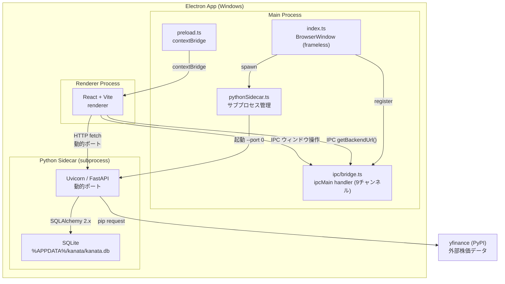
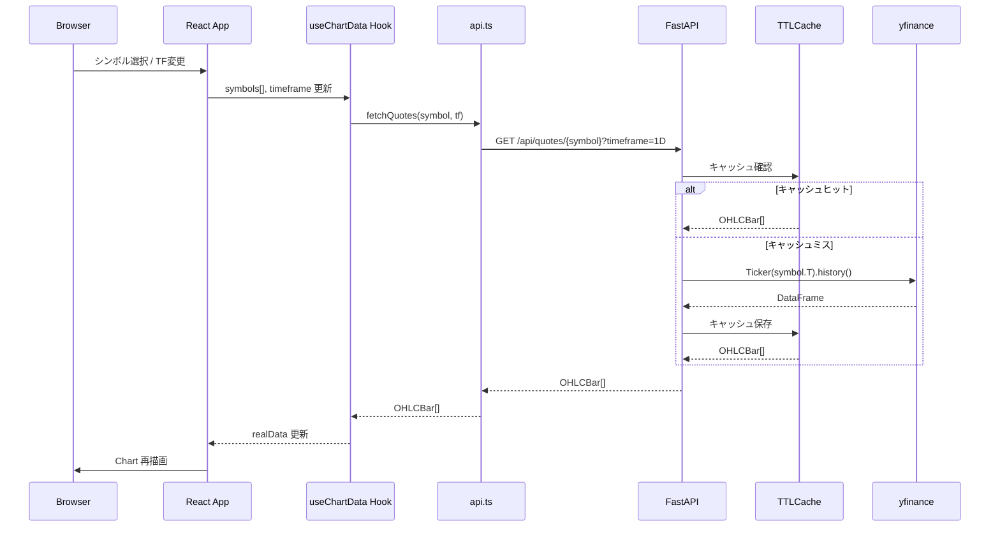
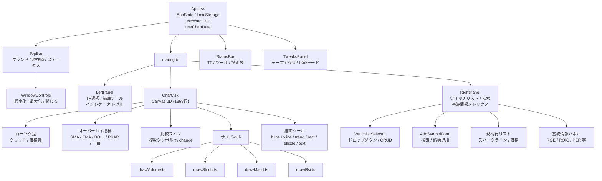
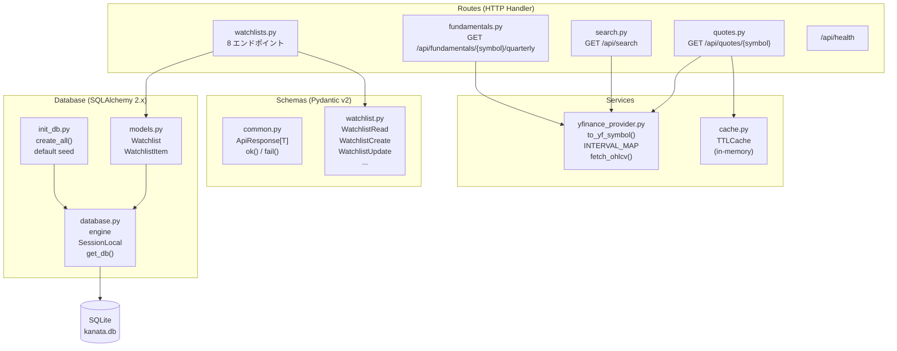
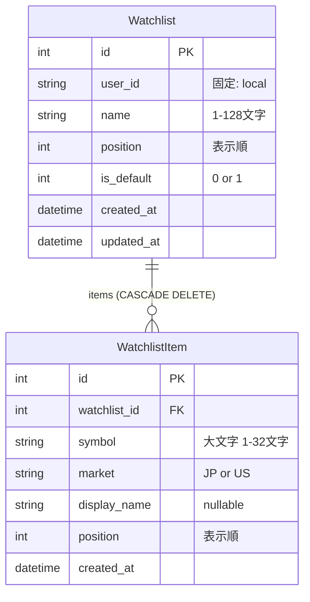
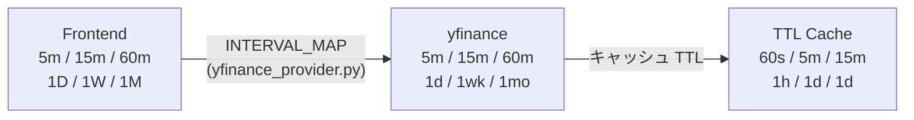

# KANATA Architecture

## 1. システム全体図



---

## 2. データフロー



---

## 3. フロントエンド コンポーネントツリー



---

## 4. 状態管理

```mermaid
graph LR
    subgraph APP["App.tsx (単一ソース)"]
        STATE["AppState\nselected[]\ntimeframe\nactiveTool\ndrawings[]\nselectedDrawingId\nindicators{}\nindicatorParams{}\nshowVolume\nshowFinancial\nfinancial{}"]
        AES["Aesthetic\ndark-blue / neutral\namber-crt / midnight"]
        DEN["Density\ncompact / comfortable"]
        AWL["activeWatchlistId"]
    end

    subgraph HOOKS["Custom Hooks"]
        USEWD["useWatchlists\n watchlists[]\n status\n CRUD メソッド"]
        USECD["useChartData\n realData{}\n status\n errors{}"]
        USEDS["useDebouncedSearch\n results[]\n loading\n 280ms debounce"]
    end

    subgraph LS["localStorage"]
        LS1["kanata.state"]
        LS2["kanata.aesthetic"]
        LS3["kanata.density"]
        LS4["kanata.activeWatchlistId"]
    end

    STATE <-- "JSON serialize" --> LS1
    AES <-- --> LS2
    DEN <-- --> LS3
    AWL <-- --> LS4

    USEWD -- "watchlists[]" --> APP
    USECD -- "realData{}" --> APP
    USEDS -- "results[]" --> ASF["AddSymbolForm"]
```

---

## 5. バックエンド レイヤー構成



---

## 6. データモデル



---

## 7. IPC チャンネル一覧

| チャンネル定数 | チャンネル名 | 方向 | 用途 |
|---|---|---|---|
| `BACKEND_URL` | `kanata:backend-url` | invoke | FastAPI の動的ポート URL 取得 |
| `BACKEND_STATUS` | `kanata:backend-status` | invoke | サイドカー状態取得 (`SidecarStatus`) |
| `OPEN_LOGS` | `kanata:open-logs` | invoke | ログディレクトリを OS で開く |
| `APP_VERSION` | `kanata:app-version` | invoke | アプリバージョン取得 |
| `WINDOW_MINIMIZE` | `kanata:window-minimize` | invoke | ウィンドウ最小化 |
| `WINDOW_MAXIMIZE` | `kanata:window-maximize` | invoke | 最大化 / 元に戻す トグル |
| `WINDOW_CLOSE` | `kanata:window-close` | invoke | ウィンドウ閉じる |
| `WINDOW_IS_MAXIMIZED` | `kanata:window-is-maximized` | invoke | 最大化状態を取得 |
| `WINDOW_MAXIMIZE_CHANGED` | `kanata:window-maximize-changed` | push | 最大化状態変化イベント |

`PreloadApi` (`packages/shared-types`) が全チャンネルの型を定義し、`window.kanata` 経由でレンダラーに公開。

---

## 8. タイムフレーム変換



---

## インフラ構成サマリー

| 項目 | 値 |
|------|-----|
| Electron | v40 / Windows ネイティブアプリ（frameless window）|
| Frontend | React 18 + TypeScript + Vite / Node 20（Renderer Process）|
| Backend | FastAPI + SQLAlchemy 2.x / Python 3.12（Sidecar subprocess）|
| DB | SQLite（`%APPDATA%/kanata/kanata.db`）|
| 外部データ | yfinance（pip）|
| 認証 | なし（`user_id = "local"` 固定）|
| キャッシュ | プロセス内メモリ TTLCache（Redis 未使用）|
